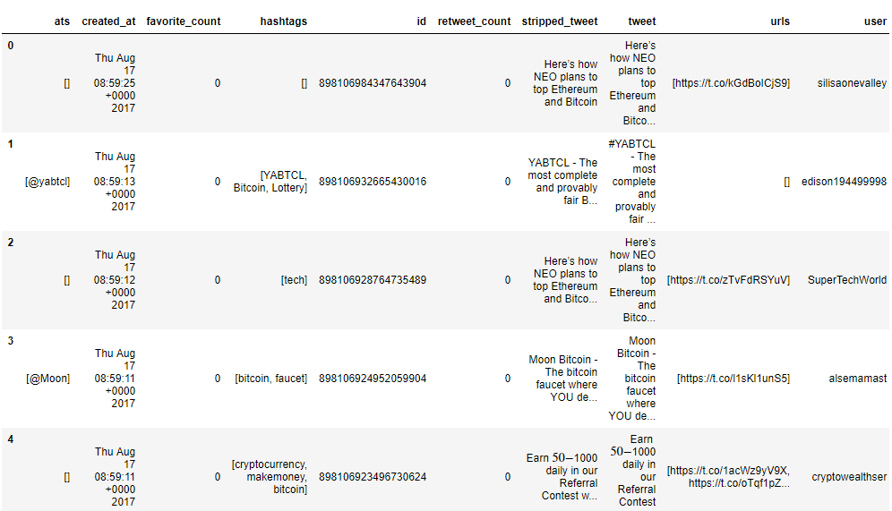
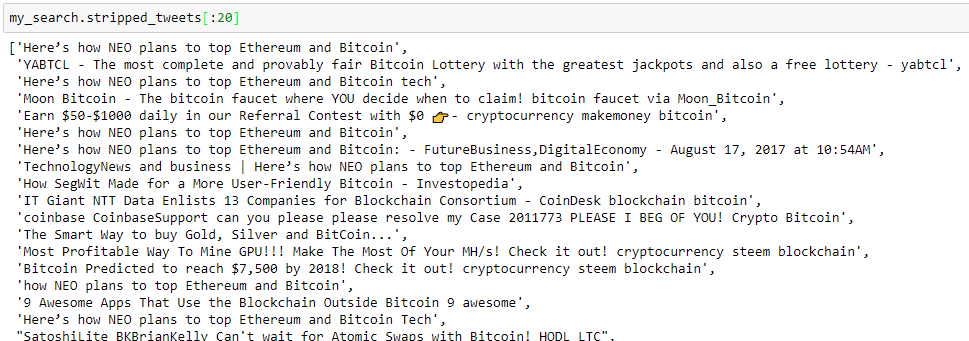
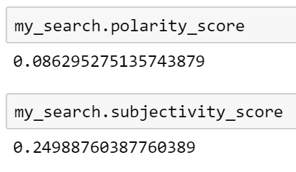
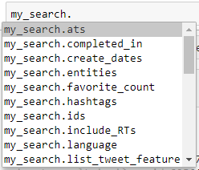
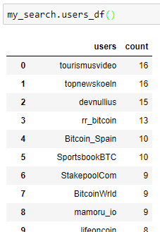

# tweezers
## Python library for twitter data analysis.
### Tweezers leverages the power of <i>requests</i> and <i>pandas</i> to provide a simple interface to scrape Twitter data and shape it into easy-to-analyse lists, dataframes, and metadata.
```python
import tweezers
```
#### Get a Pandas dataframe of thousands of tweets ready for analysis in 3 lines of code!

1) Authenticate with twitter ...
```python
auth = tweezers.tweezer_auth("your_consumer_key", 
                             "your_consumer_secret",
                             "your_access_token",
                             "your_access_token_secret")
```
2) Search for 1000 most recent tweets with the word "bitcoin" in them ...
```python
my_search = tweezers.search(tweezer_auth = auth,
                            total = 1000,
                            search_term = "bitcoin",
                            result_type = "recent")
```
<code>1000 tweets requested, 1000 tweets returned</code>

3) Start analysing the Pandas dataframe ...
```python
my_search.pandas_df()
```



#### To facilitate Natural Language Processing, the dataframe includes a <i>stripped_tweet</i> column which returns a bare-bones version of the tweet, stripped of all @ symbols, hashtags and URLs ...
This list of stripped down tweets is also accessible by the <code>.stripped_tweets</code> attribute:



#### NEW! The dataframe now includes sentiment analysis scores for each tweet
The sentiment scores are given in terms of <i>polarity</i> (how positive or negative the content is, from a scale of 1.0 to -1.0) and <i>subjectivity</i> (how objective or subjective the opinions are, on a scale of 0.0 to 1.0).

An average of both scores for the tweets returned by the search can also be accessed as attributes:



#### The search object features a number of other methods and attributes for accessing data ...



#### Try accessing one of the <code>.something_df()</code> methods to get a summary of the users, mentions, URLs, or hashtags featured in the tweets corpus ...



### <i>Tweezers</i> is in the early stages of development
#### There might be bugs! Contributions are welcome.
It has been written in Python 3.6.1, using <i>virtualenv</i> to minimise dependency issues - it is untested in Python 2.x

When it is in reasonable shape it will be packaged up on pypi for installation via <code>pip</code>

Current plan for future iterations include:
* Incorporating Natural Language Processing (e.g. using <i>spacy</i>) in the module for instant sentiment analysis.
* Building a separate <code>stream</code> class to work with the Twitter stream API.
* Creating a <code>.summary()</code> method to generate key statistics for the search results - similar to the Pandas <code>.describe()</code> method.
